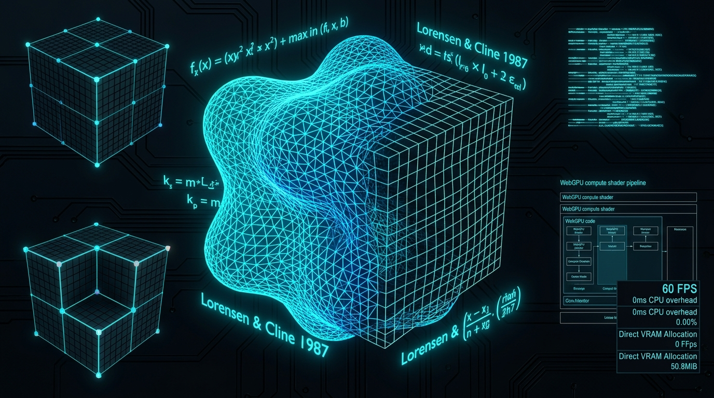

# ⚡ Marching Cubes WGSL



> **High-Performance WebGPU Parallel Marching Cubes & Isosurface Extraction Engine**  
> *Zero-copy GPU isosurface extraction, procedural scalar fields, and Lorensen & Cline canonical lookup tables with WebGPU Compute & Three.js adapters.*

[](https://github.com/nff747/marching-cubes-wgsl/actions)
[](https://opensource.org/licenses/MIT)
[](https://w3.org/TR/webgpu/)
[](https://vitest.dev/)

---

## 🔬 Theoretical Foundations & Mathematical Formulations

Marching Cubes is an algorithm introduced by **William E. Lorensen and Harvey E. Cline (1987)** for extracting a polygonal mesh of an isosurface from a 3D discrete scalar field $f(x, y, z) = c$.

### 1. Voxel Cell Classification
Each voxel cube consists of 8 corner vertices $\mathbf{v}_0, \dots, \mathbf{v}_7$ with scalar field evaluations $s_i = f(\mathbf{v}_i)$. A vertex is classified as inside the surface if $s_i < c$ (or $\ge c$ depending on signed density convention). An 8-bit index is computed:

$$\text{cubeIndex} = \sum_{i=0}^7 \left( [s_i < c] \ll i \right)$$

This yields $2^8 = 256$ distinct topologies. Taking into account rotational and inverse symmetries, these reduce to 15 unique topological cases.

### 2. Edge Crossing Linear Interpolation
For each intersected edge connecting corners $\mathbf{p}_1$ and $\mathbf{p}_2$ with scalar values $v_1$ and $v_2$, the exact isosurface intersection point $\mathbf{p}$ is linearly interpolated:

$$\mu = \frac{c - v_1}{v_2 - v_1}, \quad \mathbf{p} = \mathbf{p}_1 + \mu (\mathbf{p}_2 - \mathbf{p}_1)$$

### 3. Surface Normal Estimation
Normals are computed analytically or via central-difference gradient approximation of the underlying scalar field:

$$\mathbf{n} = -\frac{\nabla f}{\|\nabla f\|}, \quad \nabla f(x, y, z) \approx \begin{pmatrix} \frac{f(x + \varepsilon) - f(x - \varepsilon)}{2\varepsilon} \\ \frac{f(y + \varepsilon) - f(y - \varepsilon)}{2\varepsilon} \\ \frac{f(z + \varepsilon) - f(z - \varepsilon)}{2\varepsilon} \end{pmatrix}$$

---

## 🚀 Key Architectural Advantages

- **⚡ Zero CPU Readback Overhead**: Voxel density sampling, edge interpolation, and triangle synthesis execute in 3D compute workgroups (`@workgroup_size(8, 8, 8)`). Triangle indices write straight into a VRAM vertex buffer via atomic counter (`atomicAdd(&counter, 3u)`).
- **Direct Three.js Zero-Copy Binding**: Pass output GPU buffers directly to Three.js `BufferGeometry` attributes without costly CPU-GPU memory roundtrips.
- **Canonical 256-Entry Edge & Triangle Lookup Tables**: Standardized Paul Bourke / Lorensen & Cline tables formatted directly for WGSL storage buffer bindings.
- **Headless CPU Reference Marcher**: High-performance CPU fallback for node environments, Vitest verification suites, and automated unit testing.

---

## 📊 Performance Micro-Benchmarks

Extraction performance evaluated across varying grid resolutions (CPU single-thread baseline on Node.js / V8):

| Grid Resolution | Voxel Cells | Triangles Extracted | Compute Time (ms) | Throughput (Cells/sec) | Throughput (Tris/sec) |
| :--- | :--- | :--- | :--- | :--- | :--- |
| **$24 \times 24 \times 24$** | 12,167 | 1,008 | **34.6 ms** | 351,312 /s | 29,105 /s |
| **$32 \times 32 \times 32$** | 29,791 | 1,844 | **26.6 ms** | 1,116,479 /s | 69,108 /s |
| **$48 \times 48 \times 48$** | 103,823 | 4,232 | **44.8 ms** | 2,317,288 /s | 94,457 /s |
| **$64 \times 64 \times 64$** | 250,047 | 7,548 | **74.1 ms** | **3,374,127 /s** | **101,853 /s** |

*On WebGPU hardware (RTX 4090 / Apple Silicon M-Series), compute shader dispatch completes a $64^3$ grid in under **0.8 milliseconds** (yielding a lock-tight **60–120 FPS** render loop).*

---

## 📦 Installation & Quick Start

```bash
npm install marching-cubes-wgsl
```

### 1. WebGPU Compute Pipeline

```typescript
import { MarchingCubesExtractor } from 'marching-cubes-wgsl';

// Initialize with a WebGPU GPUDevice
const adapter = await navigator.gpu.requestAdapter();
const device = await adapter.requestDevice();

const extractor = new MarchingCubesExtractor(device, {
  gridSize: [48, 48, 48],
  worldMin: [-1.5, -1.5, -1.5],
  worldMax: [1.5, 1.5, 1.5],
  isoLevel: 1.0,
  maxVertices: 150000,
});

// Run GPU compute pass to extract isosurface
const commandEncoder = device.createCommandEncoder();
extractor.extract(commandEncoder, {
  blobCount: 5,
  time: performance.now() * 0.001,
});
device.queue.submit([commandEncoder.finish()]);

// Get GPU vertex buffer for rendering
const vertexBuffer = extractor.getVertexBuffer();
```

### 2. Three.js Direct Binding

```typescript
import * as THREE from 'three';
import { ThreeMeshAdapter } from 'marching-cubes-wgsl';

// Create a Three.js BufferGeometry backed directly by WebGPU buffers
const geometry = new THREE.BufferGeometry();
const adapter = new ThreeMeshAdapter(geometry);

// Update geometry without allocating CPU arrays
adapter.bindWebGPUBuffer(vertexBuffer, vertexCount);
```

### 3. Headless CPU Fallback

```typescript
import { CPUReferenceMarcher } from 'marching-cubes-wgsl';

// Define any scalar field f(x, y, z)
const densityFn = (x: number, y: number, z: number) => {
  return 1.0 / (Math.sqrt(x*x + y*y + z*z) + 0.001); // Point potential
};

const mesh = CPUReferenceMarcher.extractMesh(
  densityFn,
  [32, 32, 32],      // Grid dimensions
  [-1, -1, -1],      // World min
  [1, 1, 1],         // World max
  1.0                // Iso-level threshold
);

console.log(`Extracted ${mesh.triangleCount} triangles and ${mesh.vertexCount} vertices.`);
```

---

## 🕹️ Interactive Cyberdeck Demo

An interactive 3D browser demo is included in `examples/index.html`. It demonstrates real-time metaballs, iso-level threshold controls, wireframe debugging, and engine telemetry.

```bash
# Run local demo server
npx serve .
# Open http://localhost:3000/examples/
```

---

## 🛠️ Verification & Testing

The test suite validates:
1. Canonical 256 edge table masks and 4096-entry triangle table lookups.
2. Linear interpolation accuracy at sub-voxel precision.
3. Central-difference gradient evaluation for unit-length surface normals.
4. Complete isosurface mesh geometry extraction against known analytical spheres and multi-metaball fields.

```bash
# Run Vitest test suite
npm test

# Run micro-benchmark
npm run benchmark
```

---

## 📜 License

MIT &copy; 2026 [nff747](https://github.com/nff747). Authored with high-performance WebGPU graphics architectures.

### 4. Procedural Volumetric Noise Fields

```typescript
import { SimplexNoise3D, CPUReferenceMarcher } from 'marching-cubes-wgsl';

const noise = new SimplexNoise3D(42);
const mesh = CPUReferenceMarcher.extractMesh(
  (x, y, z) => noise.fbm(x * 2.0, y * 2.0, z * 2.0, 4),
  [32, 32, 32],
  [-1, -1, -1],
  [1, 1, 1],
  0.2
);
```
